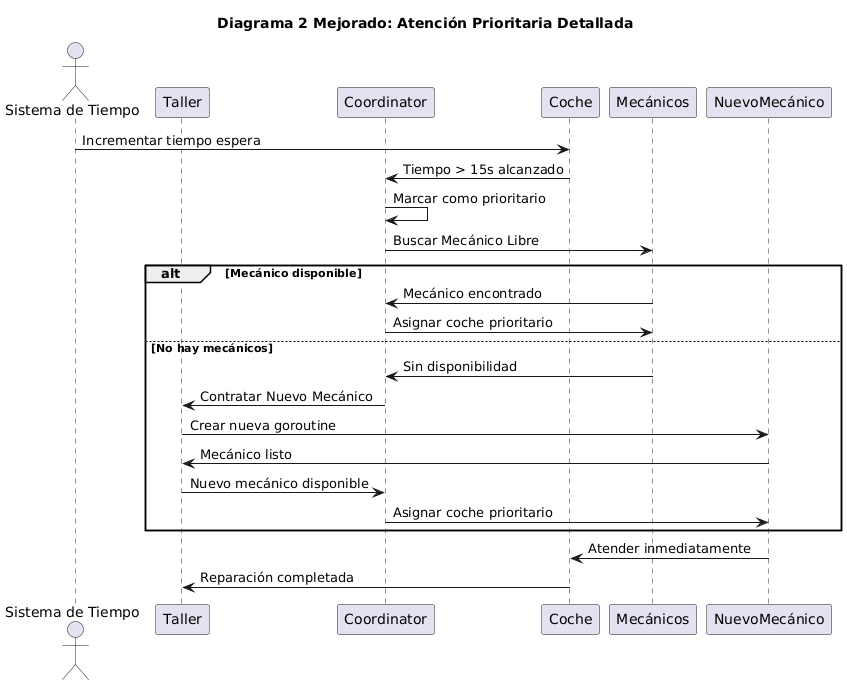

# 🚗 Práctica 2 - Taller de Coches en GO

---

## 📋 Descripción del Proyecto

Implementación de un **sistema distribuido para taller mecánico** utilizando **goroutines y channels de Go**, donde se simula la atención concurrente de vehículos por mecánicos especializados con gestión automática de prioridades y contratación bajo demanda.

### 🎯 Objetivos Principales
- Implementar concurrencia usando **goroutines y channels**
- Gestionar **colas de espera ilimitadas** con notificaciones eficientes
- Implementar **sistema de prioridades** para coches con esperas prolongadas
- Realizar **análisis comparativo** de diferentes configuraciones del sistema

---

## ⚙️ Funcionalidades Implementadas

### 🔧 Sistema de Atención por Especialidad
| Especialidad | ⏱️ Tiempo Atención |
|-------------|-------------------|
| **Mecánica** | 5 segundos | 
| **Eléctrica** | 7 segundos | 
| **Carrocería** | 11 segundos |

### 📊 Gestión Inteligente de Colas
- 🚗 Cola de espera **sin límite de tamaño**
- 🔔 Notificaciones **no bloqueantes** mediante channels  
- ⚡ **Detección automática** de coches prioritarios (>15 segundos de espera)

### 🚨 Sistema de Emergencia
- 👷 **Contratación automática** de mecánicos cuando sea necesario
- 🎯 **Reasignación prioritaria** para coches con esperas prolongadas
- ⚖️ **Balanceo dinámico** de carga entre especialistas

---

## 🔄 Diagramas de Secuencia UML

#### **1. Llegada y Atención de Coche Normal**


---

#### **2. Gestión de la Cola de Espera**  


---

#### **3. Atención Prioritaria y Contratación**


---

#### **4. Simulación Completa**


---

## 📋 **Estructuras de Datos Principales**

### 🚗 **Coche**
```go
type Coche struct {
    Matricula     string
    ID            string
    TipoIncidencia TipoIncidencia
    TiempoAtendido time.Duration
    ChanTerminado chan bool
    TiempoLlegada time.Time
}
```

### 🔧 **Mecánico**
```go
type Mecanico struct {
    ID           string
    Especialidad TipoIncidencia
    ChanTrabajo  chan *Coche
    Trabajando   bool
    taller       *Taller
}
```

### 🏢 **Taller**
```go
type Taller struct {
    Cola        *Cola
    Mecanicos   []*Mecanico
    ChanDetener chan bool
    Stats       *Estadisticas
    running     bool
}
```

### 📋 **Cola de Espera**
```go
type Cola struct {
    coches   []*Coche
    mutex    sync.Mutex
    cerrada  bool
    notify   chan struct{}
}
```
---

## ⚙️ **Funciones Principales**

### **Gestión del Ciclo de Vida**
```go
func (t *Taller) Iniciar()           // Lanza todas las goroutines
func (t *Taller) Detener()           // Cierre graceful del sistema
func (m *Mecanico) Iniciar(taller *Taller)  // Goroutine del worker
```

### **Gestión de Concurrencia**
```go
func (c *Cola) AgregarCoche(coche *Coche)   // Thread-safe con mutex
func (c *Cola) ObtenerCoche() *Coche        // Bloqueante con notify
func (t *Taller) coordinator()              // Goroutine principal
```

### **Mecanismos de Emergencia**
```go
func (t *Taller) atiendeCochePrioritario(coche *Coche)
func (t *Taller) buscarMecanicoLibreCualquierEspecialidad() *Mecanico
```

---

### 📡 Channels de Comunicación

| Channel | 🎯 Tipo | 📝 Propósito | 
|---------|---------|--------------|
| `ChanTrabajo` | `chan *Coche` | Asignación de trabajos | 
| `notify` | `chan struct{}` | Notificaciones de nueva cola | 
| `ChanDetener` | `chan bool` | Control de parada del sistema | 
| `ChanTerminado` | `chan bool` | Sincronización de finalización | 

---

## 🚀 Guía de Ejecución

---

### 🎮 Menú Principal

```
=== TALLER MECÁNICO - PRÁCTICA 2 ===
1. Gestión Manual (Clientes, Vehículos, Incidencias, Mecánicos)
2. Ejecutar Simulación Automática
3. Simulación con Datos Actuales  
4. Estado Actual del Taller
5. Ejecutar Tests
0. Salir
```
---
## 📊 Modos de Operación

### **1. 🖱️ Gestión Manual** (20-30 minutos)
- 👥 Gestión completa de clientes, vehículos e incidencias
- 🔧 Configuración personalizada de mecánicos  
- 🎯 Simulación con datos reales creados por el usuario

### **2. ⚡ Simulación Automática** (40 segundos/escenario)
- 🤖 Ejecución automática de **5 escenarios predefinidos**
- 📈 Generación de métricas completas de rendimiento
- 🚫 Sin intervención manual requerida

### **3. 🧪 Tests Individuales**
#### **Método A: Desde VS Code (Más fácil)**
1. **Abrir el archivo `taller_test.go`**
2. **Buscar las funciones de test** (cada escenario tiene su propia función)
3. **Hacer clic en el icono "Run Test"** ▶️ que aparece a la izquierda de cada función

#### **Método B: Desde Terminal**
```bash
# Ejecutar TODOS los tests
go test -v

# Ejecutar UN test específico
go test -v -run TestEscenario1_ConfiguracionBase
```

#### **Tests disponibles en `taller_test.go`:**
- `TestEscenario1_ConfiguracionBase`
- `TestEscenario2_DobleCoches` 
- `TestEscenario3_DobleMecanicos`
- `TestEscenario4_Mecanicos3Mecanica`
- `TestEscenario5_Mecanicos1Mecanica3Electricos3Carroceria`

---

## 🧪 Escenarios de Prueba

| Escenario | 🎯 Configuración | 🚗 Coches | 👷 Mecánicos | 📝 Descripción |
|-----------|-----------------|-----------|-------------|---------------|
| **Caso Base** | 1M/1E/1C | 8 | 3 | Configuración mínima funcional |
| **Doble Carga** | 1M/1E/1C | 16 | 3 | Test de estrés del sistema |
| **Doble Plantilla** | 2M/2E/2C | 8 | 6 | Test de recursos adicionales |
| **3M-1E-1C** | 3M/1E/1C | 8 | 5 | Especialización en mecánica |
| **1M-3E-3C** | 1M/3E/3C | 8 | 7 | Especialización en eléctrica/carrocería |

---

## 📈 Resultados de los Tests

### 🏆 Comparativa de Escenarios

| Escenario | ⏱️ Duración | 📊 % vs Base | 👷 Mecánicos Extra | 🚨 Coches Prioritarios |
|-----------|-------------|-------------|-------------------|----------------------|
| **Caso Base** | 36.44s | - | 2 | 4 |
| **Doble Carga** | 39.67s | +9% | 8 | 15 |
| **Doble Plantilla** | 20.92s | -43% | 0 | 0 |
| **3M-1E-1C** | 36.49s | +0.1% | 0 | 1 |
| **1M-3E-3C** | 32.43s | -11% | 0 | 0 |


### 🏅 Ranking de Eficiencia

| Posición | 🥇 Escenario | 🎯 Justificación | 
|----------|-------------|-----------------|--------------|
| **1** | **Doble Plantilla** | Más rápido + cero prioridades + cero contrataciones | 
| **2** | **1M-3E-3C** | Balance perfecto: rápido + cero congestiones | 
| **3** | **3M-1E-1C** | Similar tiempo al base pero mejor gestión | 
| **4** | **Caso Base** | Configuración mínima funcional | 
| **5** | **Doble Carga** | Estrés máximo del sistema | 

---

## 🔍 Análisis Técnico

### 🔄 Goroutines Implementadas

#### **Coordinador Principal**
```go
func (t *Taller) coordinator() {
    for t.running {
        coche := t.Cola.ObtenerCoche()
        if coche == nil { return }
        // Lógica de asignación y prioridades
    }
}
```

#### **Workers Especializados**
```go
func (m *Mecanico) Iniciar(taller *Taller) {
    go func() {
        for coche := range m.ChanTrabajo {
            tiempo := coche.TiempoAtencion()
            time.Sleep(tiempo)
            // Registrar finalización
        }
    }()
}
```

---

## 📁 Estructura del Proyecto

```
practica2-taller-coches/
├── 📂 .vscode/
│   ├── settings.json
├── 📂 crud/                 # Gestión manual P1 (CRUD)
│   ├── clientes.go
│   ├── gestion.go
│   ├── incidencias.go
│   ├── mecanicos.go
│   └── vehiculos.go
├── 📂 taller/               # Núcleo del sistema 
│   ├── coche.go
│   ├── cola.go
│   ├── mecanico.go
│   ├── simulacion.go
│   ├── taller.go
│   └── taller_test.go
├── 📂 diagramas/            # Diagramas de secuencia del sistema
│   ├── atencion_prioritaria_contatacion.png
│   ├── gestion_cola_de_espera.png
│   ├── llegada_atencion_coche.png
│   └── simulacion_completa.png
├── 📄 main.go              # Punto de entrada
├── 📄 taller_test.go
├── 📄 P2-DISTRIBUIDOS.pdf  # Memoria PDF entregable
├── 📄 go.mod
└── 📄 README.md
```

---

## 🎯 Conclusiones

### ✅ Logros Principales
- **Sistema completamente concurrente** usando goroutines y channels
- **Gestión automática de prioridades** con contratación bajo demanda
- **Mecanismos de sincronización** robustos y libres de race conditions
- **Análisis comparativo exhaustivo** de diferentes configuraciones

### 🚀 Aportaciones Técnicas
- **Sistema de métricas integrado** para análisis de rendimiento
- **Múltiples modos de operación** que cubren desde desarrollo hasta producción
- **Tests automatizados** que validan tanto funcionalidad como rendimiento

---

## 🔗 Enlaces

- **📚 Documentación Completa**: [PDF de la Práctica](P2-DISTRIBUIDOS.pdf)
- **📋 Enunciado Original**: [2_practica_ssdd_dist.pdf](2_practica_ssdd_dist.pdf)

---

## 👨‍💻 Autor

**Juan Sánchez Vinuesa**  
Ingeniería en Telemática  
Sistemas Distribuidos - GIT - URJC  
Curso 2025/2026

